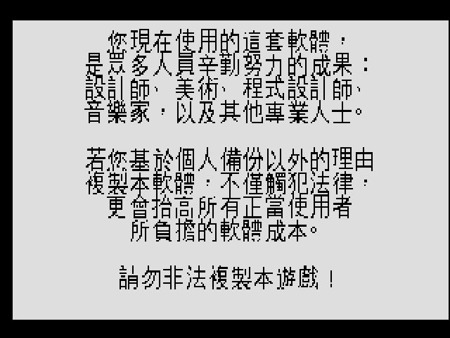

# 人生劇場（Jones in the Fast Lane）— 繁體中文化

Sierra 1990 年經典**現代都市生活模擬**遊戲的**繁體中文化**專案，跑在 **ScummVM SCI 引擎**上，
中文化以 **ScummVM patch** 形式交付（引擎繪字改動 + 散裝中文資產），不散布原遊戲資源。

> 引擎：ScummVM **SCI**（非 AGS）。技術路線＝沿用 SCI 引擎既有的日/韓 CJK 範式，
> 新增一條**繁體中文（`ZH_TWN` + Big5）黑體**繪字路徑。譯名以**當年官方中文手冊**為準。

---

## M1 spike 成果（已實機驗證）

啟動版權畫面經 SCI 文字路徑 + Big5 黑體（文泉驛正黑）渲染為繁體中文：

---

## 這是什麼遊戲？

你扮演一位剛搬進小鎮、口袋只有 **$200 老本**的市民，在一張棋盤式地圖上吃飯、上班、購物、
上學、投資，追逐人生四大目標——**財富、快樂、學歷、職業**。最先把四項都達到設定點數者獲勝。
可單人挑戰電腦對手「瓊斯」，或最多 4 人同樂。時間以指針計，**轉一圈＝一星期**；每月要付房租、
每週要吃飯，否則餓昏送醫、崩潰路邊。核心循環：

> 職業介紹所找工作 → 上班賺錢 → 大學進修解鎖高薪工作 → 銀行存款/投資/貸款 → 商店消費換快樂 →
> 缺錢時當舖典當或買樂透碰運氣。

## 文件索引

| 文件 | 內容 |
|---|---|
| [docs/00-feasibility.md](docs/00-feasibility.md) | 可行性評估：版本、資源盤點、技術路線、已解卡點、風險、里程碑 |
| [docs/10-terminology.md](docs/10-terminology.md) | 術語表：官方中文譯名（四大目標/地點/角色/系統） |
| [WORKLIST.md](WORKLIST.md) | 工作交接：引擎改動、工具鏈、關鍵指令、踩雷、下一步 |

## 中文手冊要點（軟體世界珍藏版 76）

**四大目標達成途徑**
- **職業**：常換工作、勤跑職業介紹所爭取晉升。
- **快樂**：有錢就買奢侈品、看秀、喝奶昔、在家放鬆（Relax）。
- **學歷**：去高等技術大學修學科，修越多學歷越高，並解鎖更好的職業。
- **財富**：累積現金、儲蓄、投資與資產淨值。

**11 處地點**：職業介紹所、大石頭漢堡店、高等技術大學、工廠、Q.T 服飾店、租屋中心、
布萊克超市、「多插座城市」電器行、Z-超商、銀行、當舖。

**操作**：鍵盤/搖桿/滑鼠皆可；游標移到目的地按確定即自動前往。
`F1` 說明、`F2` 音樂、`F3` 音效、`F4` 統計、`F5` 存檔、`F7` 讀檔、`F10` 遊戲背景、`Ctrl+Q` 離開。
存檔**只有一個進度**（新存檔覆蓋舊的）。

**十二點提示**：開局先拚財源、每週吃飯、找工作從廚師/工友做起、盡量提高學歷換高薪、
適時回家放鬆、每月付房租、別帶太多現金（會被搶）、公債賠慘可貸款、走投無路買樂透、
常看報紙掌握時事（會影響職業與漢堡售價）。

## 交付原則

- 中文化**僅放 ScummVM patch**（引擎繪字改動 + Big5 黑體字 + 內容替換 TSV），原遊戲資源不入庫、不散布。
- 完整性優先：文字 + 烘字 UI 都要中文化（retro 完整性原則）。

## 相關專案

- 英雄傳奇 I（Quest for Glory 1）繁中化（同 SCI 引擎）：<https://github.com/wicanr2/qfg-cht-1>
