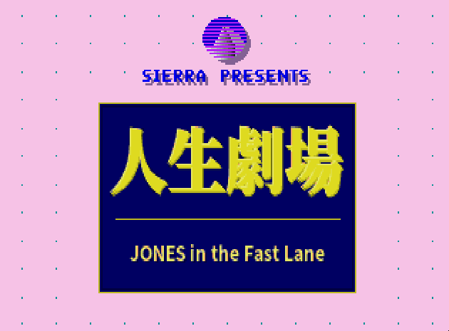
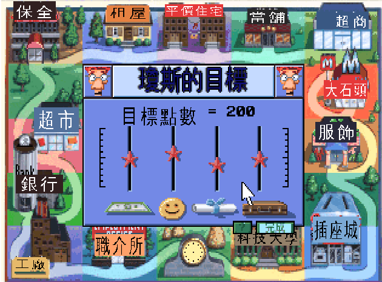
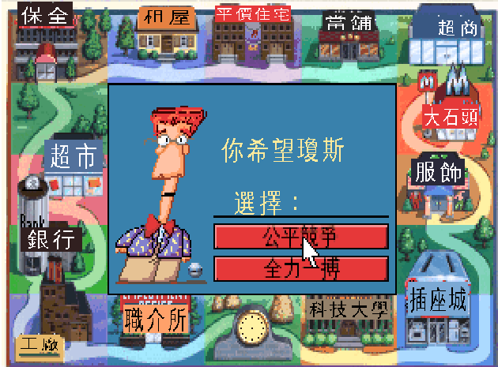
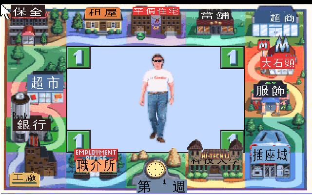
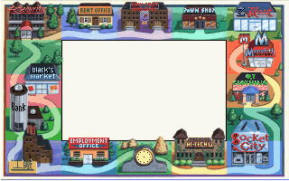
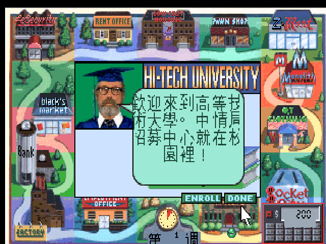

# 人生劇場 中文遊戲手冊（整理）

> 本文依**當年官方中文手冊**（《軟體世界》珍藏版 76〈人生劇場〉，Sierra On-Line／台灣代理）整理成要點，
> 保留手冊原有的分章與生動語氣，供遊玩參考。**原始掃描頁面含版權，不隨庫散布**；此處為文字要點與重繪的繁中遊戲畫面。
> 文字編輯：劉瑋　美工編輯：陳金泰（原中文手冊）。

   
  <em>標題畫面 —— 官方中文名「人生劇場」</em>

---

## 目錄

1. [前言 —— 幸福人瓊斯的自我介紹](#一前言)
2. [這是什麼遊戲](#二這是什麼遊戲)
3. [操作方法](#三操作方法)
4. [進入遊戲](#四進入遊戲)
5. [遊戲方法與四大人生目標](#五遊戲方法與四大人生目標)
6. [棋盤生活 —— 十一處地點](#六棋盤生活十一處地點)
7. [存取遊戲](#七存取遊戲)
8. [十二點過關提示](#八十二點過關提示)
9. [製作團隊](#九製作團隊)

---

## 一、前言

> 手冊開卷，遊戲主角瓊斯（JONES）親自向你打招呼——這段文字最能代表這款遊戲的調性，原文照錄：

「大家好！我是**幸福人瓊斯（JONES）**，你想了解我轟轟烈烈的一生嗎？現在你可以把一切煩惱、
缺憾、不如意都放下，到這個忙碌依舊但卻充滿驚奇的世界來放鬆自己啦！

在這裡，你可以窮困潦倒、兩袖清風的過一輩子；也可以叱吒風雲、耀武揚威的度過一生。但是窮與富，
對這個遊戲、對你，並無很大的影響，我們只是要你真正享受並體會到這遊戲所蘊涵的**生活樂趣**罷了！
不管你是整日埋首的學生，或是汲汲營營的上班族，都會喜愛瓊斯這老小子所提供給你的『好東西』。」

> 瓊斯：「告訴你！很好玩哦！騙你的話就把我的寶貝老婆給你。」

---

## 二、這是什麼遊戲

《人生劇場》是一款**現代都市生活模擬**遊戲。你在一座棋盤式的小鎮上生活：吃飯、上班、購物、
上學、投資、看秀——把「過日子」本身變成一場競賽。

- 起跑點：**渾身上下只有 $200 老本**，沒有存款、沒有學歷、也沒有工作。
- 目標：追逐**財富、快樂、學歷、職業**四大人生目標，最先把四項都達到設定點數者獲勝。
- 對手：可單人挑戰電腦控制的「瓊斯」，或最多 **4 人**同鎮競逐。
- 時間：畫面下方的指針**轉一圈＝一個星期**；每星期要吃飯，每月要付房租，否則餓昏送醫、崩潰路邊。

---

## 三、操作方法

### 滑鼠

| 操作 | 功能 |
|---|---|
| 左鍵 | 確定鍵（游標移到目的地按左鍵即自動前往） |
| 右鍵 | 顯示統計值；移到螢幕左上角按住右鍵可拉出選單，放開即執行選項 |

### 功能鍵

| 鍵 | 功能 | 鍵 | 功能 |
|---|---|---|---|
| `F1` | 控制鍵功能表（輔助說明） | `F7` | 提取遊戲進度（讀檔） |
| `F2` | 音樂 開／關 | `F8` | 開／關訊息提示 |
| `F3` | 音效 開／關 | `F9` | 重新開始遊戲 |
| `F4` | 顯示統計值畫面 | `F10` | 介紹遊戲來龍去脈 |
| `F5` | 儲存遊戲 | `Esc` | 暫停並拉出選單 |
| `F6` | 顯示所有玩者狀況 | | |

### 組合鍵

`Ctrl+E` 刪除目前玩者所有資料｜`Ctrl+Q` 跳出遊戲｜`Ctrl+R` 調整磁碟讀取速度｜
`Ctrl+S` 調整速度｜`Ctrl+V` 調整音效大小｜`Ctrl+Y` 設定存檔路徑｜`Shift+左鍵`＝右鍵。

---

## 四、進入遊戲

版權與片頭畫面皆可按 `Enter` 跳過。主選單三個選項：

- **PLAY GAME**：開始新遊戲
- **RESTORE GAME**：提取已存進度
- **WATCH DEMO**：觀看遊戲示範

開新遊戲的流程：

1. **選擇人數**：最多 4 人同時遊戲。
2. **選擇代表人物**：4 種造型、各有代表顏色，移到 `SELECT` 確定。
3. **設定目標**：財富、快樂、學歷、職業四項，用方向鍵調整**目標點數**（預設 200）。
   移到 `?` 按 `Enter` 可看達成建議，設定好移到 `PLAY` 開始。
4. **是否挑戰瓊斯**（單人）：選 `Yes` 讓電腦控制的瓊斯（灰色代表球）加入競爭。

  
   
  <em>左：設定四大目標點數　右：決定瓊斯的命運</em>

**決定瓊斯的命運**（挑戰模式的三種難度）：

| 選項 | 原文 | 含意 |
|---|---|---|
| 順其自然 | *take it easy* | 讓瓊斯的前途順其自然發展（較輕鬆） |
| **公平競爭** | *play fair* | 與瓊斯光明正大且公平的競爭 |
| **全力一搏** | *go for broke* | 讓瓊斯全力衝刺，甚至走上「破產」一途（最難） |

---

## 五、遊戲方法與四大人生目標

遊戲主畫面是一個棋盤，中央方格顯示所有人物與情況，畫面上任何一棟建築物你都可以走進去。
在有限的時間內（指針轉一圈為一週），盡量**吃東西、工作、上學**，才能早日達成目標。

   
  <em>棋盤主畫面 —— 十一處地點環繞，中央是角色與週次時間軸</em>

### 四大目標的達成途徑

| 目標 | 原文 | 怎麼拿分 |
|---|---|---|
| **職業** | CAREER | 常換工作、勤跑職業介紹所爭取晉升，證明你是個對工作「上癮」的人。 |
| **快樂** | HAPPINESS | 有錢就買奢侈品享受（立體音響、豪華浴缸…）、看拉斯維加斯大秀、喝巧克力奶昔，或在家放鬆（Relax）。 |
| **學歷** | EDUCATION | 有錢有閒就上大學修學分，修的科目越多學歷越高——學歷也連帶影響你能做的職業好壞。 |
| **財富** | MONEY | 得點看**財產淨值**：現金、存款、投資的事業與一切物品；當個努力賺錢置產的「守財奴」。 |

---

## 六、棋盤生活 —— 十一處地點

> 這個棋盤似的空間就是你、其他玩者與瓊斯的生存空間，一輩子都得在這裡度過。除了當舖、職業介紹所
> 與兩棟出租公寓（低價位／高級隱密），其餘地方都能找到適合你的工作。到地點後選 `WORK` 開始工作、
> 選 `DONE` 離開。

| # | 地點 | 原文 | 功能 |
|---|---|---|---|
| 1 | **職業介紹所** | Employment Office | 提供九種不同層次的工作；學歷／經驗不足會被打回票，符合就「You got the job」。 |
| 2 | **大石頭漢堡店** | Monolith Burgers | 速食店；人每天都要吃東西，價格隨時事升降。 |
| 3 | **高等技術大學** | Hi-Tech University | 選修學科（各科以一本書表示），先 `ENROLL` 登記；修到書上數字歸 0 即拿到證書。 |
| 4 | **工廠** | The Factory | 須先修過機械工程相關學科才能錄取；薪水很高。 |
| 5 | **Q.T 服飾店** | Q.T Clothing | 注重「門面」的社會裡，居家／外出／上班族服裝一應俱全。 |
| 6 | **租屋中心** | Rent Office | 付房租、換新公寓；老闆娘勢利苛刻，欠租會從你薪水扣。 |
| 7 | **布萊克超市** | Black's Market | 食物供應站（有冰箱可囤糧）；另賣**樂透（Lottery）**與報紙。 |
| 8 | **多插座城市電器行** | Socket City | 快樂與享受的「泉源」——有錢就來大採購家電。 |
| 9 | **Z-超商** | Z-Mart | 雜貨與便宜／高級貨；常賣音樂會、演奏會、職棒比賽的預售票。 |
| 10 | **銀行** | Bank | 工作的「鐵飯碗」（學歷夠可賺大錢）；可存款、貸款、各項投資。 |
| 11 | **當舖** | Pawn Shop | 生活拮据時的去處：`PAWN` 典當、`REDEEM` 贖回、`BUY` 買別人當掉的東西。 |

  
   
  <em>左：工廠（棋盤招牌中文化）　右：高等技術大學選課</em>

---

## 七、存取遊戲

- **存檔**：按 `F5` 或從選單選 `SAVE GAME`。本遊戲**只保留一份進度**，新存檔會覆蓋舊的；
  出現「THE GAME SAVED」表示成功。
- **讀檔**：主選單 `RESTORE GAME`，或遊戲中選 `Yes` 提取；硬碟版直接由存檔子目錄提出即開始遊戲。

---

## 八、十二點過關提示

1. 開局前幾週**全力廣集財源**——穩固的財力才供得起吃、穿、上學。
2. 每星期**別忘記吃東西**，否則餓昏被送醫院，還損失時間。
3. 找工作先到職業介紹所，**從基層做起**（廚師 cook、工友 janitor）；沒空缺就下週再來。
4. 盡量**提高學歷**，才能拿到薪資較高的工作。
5. 適時**回家放鬆（Relax）**，否則會崩潰在路上。
6. **每月（四週）付一次房租**，螢幕會提醒「Rent is due」。
7. **別帶太多現金**在身上——宵小盜匪隨時準備把你打劫個精光。
8. 公債賠慘可向銀行貸款；當「拒絕往來戶」就到當舖典當音響電視；走投無路就買張樂透碰運氣。
9. **常看報紙**掌握時事——局勢會影響你的職業，甚至連漢堡售價都跟著變。

---

## 九、製作團隊

Sierra On-Line, Inc.（Coarsegold, CA），1990。

- **Executive Producer**：Ken Williams
- **Creative Director**：Bill Davis
- **Producer**：Guruka Singh Khalsa
- **Lead Programmer**：Warren Schwader
- **Artists**：Jim Larsen、Andy Hoyos
- **Composer / Sound Effects**：Ken Allen
- **Based on an Original Design by**：Meredith Whaley、Christopher Whaley、Robert Whaley、Kelly Walker
- **Documentation**：Marti McKenna
- **中文手冊**：文字編輯 劉瑋／美工編輯 陳金泰（《軟體世界》珍藏版 76）

---

> 回到專案首頁：[README.md](../README.md)
